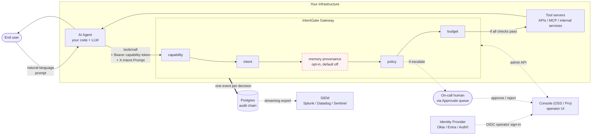
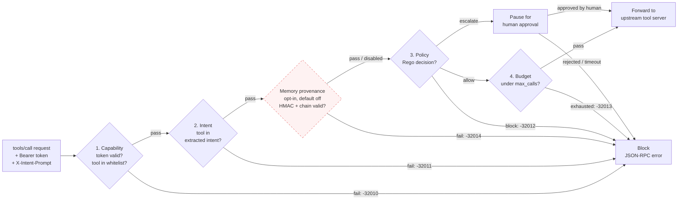

# IntentGate Docs

End-user documentation for platform engineers, security engineers, and developers integrating IntentGate into their AI agent stack. Each guide is focused on a single milestone you'll hit when bringing the gateway into your environment.

If you want the whole mental model before any one check, read **[00 — Architecture](./00-architecture.md)** first. It covers the bidirectional inspection pipeline (request side: capability → intent → provenance → policy → budget → PII out → tenant scope → fault isolation; response side: PII in → output schema), the trust boundary, the audit chain, and the reasoning behind the major design decisions.

If you're new here and want to see something fire on a real request, start with **[01 — Quickstart](./01-quickstart.md)** instead. It gets a gateway running locally in five minutes against an in-memory backend.

## Where IntentGate sits

The gateway sits between your AI agent and the tool servers it wants to call. Your existing identity stack (Okta / Entra / Auth0) handles human operators signing in to manage the gateway. The gateway itself authorizes *every individual tool call* an agent makes, using HMAC-signed capability tokens that are independent of the human identity layer.

The dotted lines are operational paths (who watches the gateway, who handles escalations); the solid lines are the request hot path. Audit goes into Postgres synchronously inside the same transaction as the chain head advance, so an event is durable before the response leaves the gateway.

## The four-check pipeline

What happens inside the gateway on every `tools/call`:

Four independent failure modes, four distinct JSON-RPC error codes downstream consumers can branch on. Each defends against a different class of agent failure: stolen credentials (capability), prompt injection (intent), over-broad permissions (policy), runaway loops (budget). Escalate is the policy's "I'm not sure, ask a human" outcome — the request pauses until an operator decides via the approvals queue.

The dashed node — memory provenance — is an opt-in fifth check that verifies the memory entries which shaped the tool call are HMAC-signed under the same capability trust boundary. It defends against the sophisticated case of OWASP Agentic AI Top 10 AGENT06 (Memory Poisoning) where attacker-planted memory entries align with the user's prompt (passing the intent check) but corrupt the tool call's arguments. When `INTENTGATE_PROVENANCE_ENABLED` is unset (the default), the node is a transparent pass-through and the pipeline behaves exactly as the four-check description above. See [`05-memory-provenance.md`](./05-memory-provenance.md) for the wire contract, SDK integration, and the `-32014` failure semantics.

| # | Guide | Audience | Time |
|---|-------|----------|------|
| 00 | [Architecture — the bidirectional inspection model](./00-architecture.md) | Engineers new to IntentGate | 10 min |
| 01 | [Quickstart — gateway running in 5 minutes](./01-quickstart.md) | Anyone evaluating IntentGate | 5 min |
| 02 | [Your first Rego policy](./02-first-policy.md) | Platform / security engineer | 15 min |
| 03 | [Wire your first agent (Python SDK)](./03-first-agent.md) | Application developer | 15 min |
| 04 | [Querying audit and verifying the chain](./04-audit-verify.md) | SOC analyst / compliance | 10 min |

Beyond these four guides:

- **The gateway README** ([../README.md](../README.md)) — full feature list, architecture, contributor / build-from-source instructions.
- **The deployment runbook** — 23-page operational guide covering production deployment (Helm), day-2 operations (monitoring, scaling, backup/restore), and incident playbooks. Available via `/contact` on [intentgate.app](https://intentgate.app/contact).
- **API reference** — every `/v1/admin/*` endpoint with request/response shapes. Coming to `docs.intentgate.app` as the docs site comes online; in the meantime the source of truth is [`internal/handlers/`](../internal/handlers/) in this repo.
- **The companion repos:**
  - [`intentgate-helm`](https://github.com/NetGnarus/intentgate-helm) — Kubernetes chart deploying gateway + extractor + Postgres.
  - [`intentgate-extractor`](https://github.com/NetGnarus/intentgate-extractor) — the intent extractor service (FastAPI + Claude Haiku, with offline stub).
  - [`intentgate-sdk-python`](https://github.com/NetGnarus/intentgate-sdk-python) — Python SDK.
  - [`intentgate-sdk-typescript`](https://github.com/NetGnarus/intentgate-sdk-typescript) — TypeScript SDK.

## The four controls

Every page assumes you've read this:

IntentGate evaluates each tool call through four independent checks before it forwards to the upstream tool server. Each check has its own failure mode and its own JSON-RPC error code so audit downstream can distinguish them.

1. **Capability** — Did the agent present a valid HMAC-signed token whose caveats permit *this specific tool*? Failure: `-32010`. Defends against stolen credentials and over-broad tokens.
2. **Intent** — Does the agent's declared purpose (the `X-Intent-Prompt` header, run through the intent extractor) include this tool in its `allowed_tools` list? Failure: `-32011`. Defends against prompt injection — an attacker can't change the user's intent into one that suddenly needs `transfer_funds`.
3. **Policy** — Does the loaded Rego policy say allow / block / escalate for this call given the agent, tool, args, and intent? Failure: `-32012`. Defends against over-broad permissions — your policy can constrain what's allowed even when capability and intent already passed.
4. **Budget** — Is the agent's per-token call counter still under its `max_calls` cap? Failure: `-32013`. Defends against runaway loops and metering excess.

An optional fifth check, **memory provenance**, is available as an opt-in deepening of the intent check — disabled by default, enabled per-deployment via `INTENTGATE_PROVENANCE_ENABLED=true`. It verifies that memory entries which shaped the tool call were HMAC-signed under the same capability trust boundary, closing the sophisticated case of OWASP Agentic AI Top 10 AGENT06 (Memory Poisoning). Failure: `-32014`. See [`05-memory-provenance.md`](./05-memory-provenance.md) for the cross-language wire contract and SDK integration.

Every decision (allow at any stage, block at any stage, escalate from policy to human approval) emits one audit event into a per-tenant cryptographic hash chain. That chain is what [Guide 04](./04-audit-verify.md) shows you how to query and verify.

For a longer essay framing the threat model these controls address, read [The four-control bypass](https://intentgate.app/why-intentgate) on the website.
